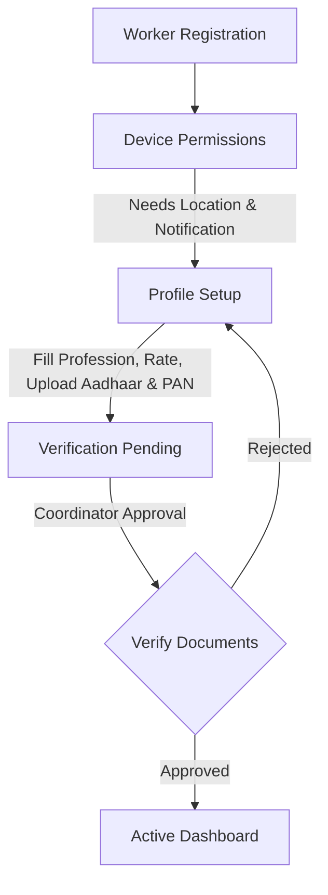

# Workkar - On-Demand Handyman & Service Freelancer Portal

Workkar is a comprehensive MERN-stack platform designed to connect local freelance technicians and handymen (Carpenters, Plumbers, Electricians, etc.) with customers needing immediate, on-demand services. It features real-time job pipelines, location-based matching, worker document verification onboarding, and role-based administration dashboards.

---

## 🛠️ Technology Stack

### Frontend
- **Framework & Tooling**: [React 19](https://react.dev/) + [Vite](https://vite.dev/) (fast dev & build environment)
- **Styling**: [Tailwind CSS v4](https://tailwindcss.com/) (modern CSS layout system)
- **Routing**: [React Router DOM v7](https://reactrouter.com/)
- **Animations**: [Framer Motion](https://www.framer.com/motion/) (smooth state and route transitions)
- **Data Visualization**: [Recharts](https://recharts.org/) (interactive analytics graphs)
- **Icons**: [Lucide React](https://lucide.dev/) & [React Icons](https://react-icons.github.io/react-icons/)
- **Maps API**: [@react-google-maps/api](https://www.npmjs.com/package/@react-google-maps/api)

### Backend
- **Runtime**: [Node.js](https://nodejs.org/) & [Express](https://expressjs.com/)
- **Database & ORM**: [MongoDB](https://www.mongodb.com/) & [Mongoose](https://mongoosejs.com/) (ODM for object mapping)
- **Authentication**: JWT (JSON Web Tokens) & Google OAuth (via `google-auth-library`)
- **File Uploads**: [Multer](https://github.com/expressjs/multer) (handling profile photos, Aadhaar, and PAN card documents)
- **Security**: [BcryptJS](https://github.com/dcodeIO/bcrypt.js) (password hashing)

---

## 📂 Project Directory Structure

```text
Workkar-Main/
├── backend/                  # Backend Node.js / Express Server
│   ├── config/               # Database connection setup (db.js)
│   ├── controllers/          # Onboarding handlers (auth, permissions, profile uploads)
│   ├── middleware/           # Request verification guards (protect, authorize)
│   ├── models/               # MongoDB Schemas (User.js, Worker.js, AuditLog.js)
│   ├── routes/               # API endpoints (admin, auth, jobs, workers, worker/)
│   └── server.js             # Main server bootstrap & database seeding
│
├── public/                   # Public assets (icons, static graphics)
├── src/                      # Frontend React codebase
│   ├── assets/               # UI components assets and SVGs
│   ├── components/           # Shared widgets (Navbar, Footer, ServiceCard, WorkerCard, Charts)
│   │   └── worker/           # Worker UI elements (Stepper, PermissionCard, UploadCard)
│   ├── context/              # WorkkarContext state (Auth state, API booking handlers, notifications)
│   ├── data/                 # Client mockData
│   ├── layouts/              # Theme wrappers (ClientLayout, WorkerLayout, AdminLayout)
│   ├── pages/                # App pages (Home, Services, Login, Dashboards)
│   │   └── worker/           # Onboarding states (Register, Login, Permissions, ProfileSetup, Pending)
│   ├── routes/               # Custom routes config (workerRoutes.jsx)
│   ├── services/             # API client utilities (workerApi.js)
│   ├── App.css               # Core custom styles
│   ├── App.jsx               # Main React entry router & ProtectedRoute guard
│   └── index.css             # Tailwind CSS entry imports
│
├── .env                      # Frontend environment configs (Google Auth Client ID)
└── package.json              # Frontend dependencies and npm scripts
```

---

## 👥 User Roles & System Capabilities

Workkar supports four distinct roles:

| Role | Description | Key Capabilities |
| :--- | :--- | :--- |
| **Customer** | End-users seeking services | Search handymen by profession, view profiles & review scores, submit instant booking requests, cancel bookings, and review workers. |
| **Worker** | Service providers / Handymen | Register, request permissions, complete personal/professional info, upload ID documents for review, accept/decline bookings, progress jobs, and manage wallets. |
| **Admin** | Coordinators overseeing operations | Review pending worker applications, approve/reject credentials, suspend/restore users and workers, and monitor platform performance. |
| **Supreme Admin** | Superuser | Full system administration, promote/demote admins, view detailed security/audit logs, override user status. |

---

## 🔄 Core Workflows

### 1. Worker Onboarding Flow
To maintain platform security, worker profiles are heavily verified. Access is gated by `WorkerProtectedRoute` checking these steps:



- **Permissions Page**: Gathers location and notification consent (`/worker/permissions`).
- **Profile Setup**: Worker inputs profile info and uploads physical copies of ID cards (`/worker/profile-setup`).
- **Review Queue**: Documents go to the Admin portal for verification.
- **Access Level**: APPROVED workers get full access to the active dashboard. REJECTED workers must update files and resubmit.

---

### 2. Real-Time Job Lifecycle Pipeline
Jobs progress through a 4-step real-time pipeline:


1. **Alert (Step 1)**: Customer submits a booking. The matched worker receives an alert card and has options to **Accept** or **Decline** the offer.
2. **Heading to Customer (Step 2)**: Worker accepts the job, changes status to "En Route", and GPS tracking initializes.
3. **Start Service (Step 3)**: Worker arrives and clicks "Start Service".
4. **Job Completed (Step 4)**: Worker completes the tasks. The database calculates earnings, credits the worker's wallet, updates the customer's history, and prompts the customer to write a review.

---

## 🔑 Seeding / Default Accounts

The backend server automatically seeds default records if the database is empty on start. Use the following credentials for testing:

- **Supreme Admin**: `lakshyakumrawat07@gmail.com` / `luckyadminpassword`
- **Coordinator (Admin)**: `admin@workkar.com` / `adminpassword`
- **Customer**: `customer@workkar.com` / `customerpassword`
- **Workers** (Default Password: `password123`):
  - Marcus Johnson (Carpenter) - `marcus@workkar.com`
  - Sarah Davis (Plumber) - `sarah@workkar.com`
  - John Doe (Electrician) - `john@workkar.com`
  - Elena Rodriguez (Electrician, Pending Status) - `elena@workkar.com`

---

## 🚀 Running the Project Locally

### 1. Prerequisites
Ensure you have Node.js and MongoDB installed and running locally:
```bash
mongodb://127.0.0.1:27017
```

### 2. Setup and Run with Unified Commands
You can set up and run both the frontend and backend simultaneously using these root npm scripts:

**Step A: Install all dependencies (Frontend & Backend)**
```bash
npm run install-all
```

**Step B: Start both Frontend and Backend concurrently**
```bash
npm run start
```

This starts:
- The **Backend API server** at `http://localhost:5000` (connecting to your local MongoDB with default dev fallbacks)
- The **Frontend React server** at `http://localhost:5173`

Open `http://localhost:5173` in your browser. All default accounts are automatically seeded into MongoDB on server startup if the database is empty!
